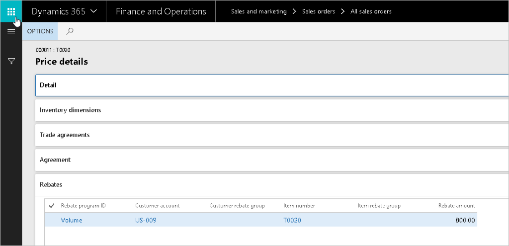
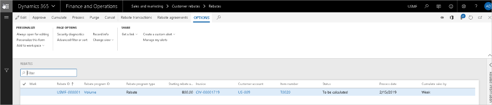
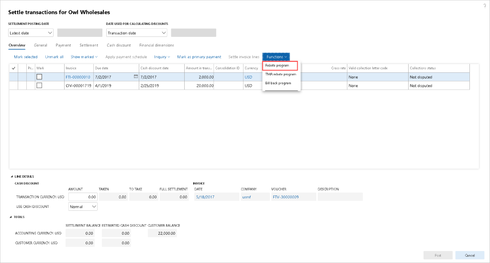
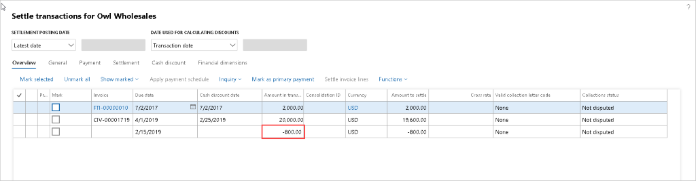

Exercise 1: Create purchase agreements 
=======================================

Create a Purchase Agreement 
----------------------------

We have agreed upon a price for 100 of item number D0002 at a price of
\$145.50USD with vendor Fabrikam Supplier. 

### Create a purchase agreement. 

1.  Go to the **Procurement and sourcing** module, then to **Purchase
    agreements**, and then to **Purchase agreements**. 

2.  Click **New**. 

3.  Vendor account: Select **US-104** (Fabrikam Supplier). 

4.  Purchase agreement classification: Select **General purchases**. 

5.  Open the **General** FastTab. 

6.  Document title: Enter **General Purchase**. 

7.  Default commitment: Select **Product quantity commitment**. 

8.  Click **OK**. 

9.  Add an item to the purchase agreement:

10. Click **Add line** in the **Purchase agreement lines** FastTab to create a
    line. 

11. Item number: Select **D0002** (Cabinet). 

12. Site: Select **1** (Home speakers production). 

13. Warehouse: Select **13** (Finished Goods). 

14. Quantity: Enter **100**. 

15. Unit price: Enter **145.50**. 

16. Expiration date: Select the end of the next month. 

17. Click **Save**. 

18. Confirm the purchase agreement:

19. Click **Purchase Agreement** at the top, and then select **Confirmation**
    under the **Generate** section. 

20. Select **Yes** in the **Print report** field. 

21. Click **OK**. 

22. Close all pages. 

 

 

Exercise 2: Configure Rebates 
==============================

Generate and process customer rebates 
--------------------------------------

1.  In **USMF** navigate to the **Accounts Receivable \> Setup \> Accounts
    receivable parameters** page, click the **Prices** tab and expand the
    **Price details** tab, and check that the **Enable price** details option is
    set to **Yes**.  

 

2.Navigate to the **Sales and marketing\>Customer rebates\>Rebate agreements**
    page and select the **customer rebate agreement**: USMF-000001.  

 

3.If the Workflow approval status field is not set to **Approved**, you need
    to click **Validation** on the Action pane to approve it. 

Review a customer rebate agreement 

-   The agreement is for an individual customer, in this example customer
    US-009. 

-   Rebates are given to the customer when they purchase a specific product. In
    this case, the product has item number T0020. 

-   The customer's sales performance, against which the rebate amounts are
    estimated, is to be accumulated on a weekly basis. 

 

-   The setting for “Price taken from” is Gross, which means that line's sales
    amount on which basis the claim is estimated is not reduced by the line
    discount. 

-   The Rebate line break type field shows the method for calculating rebates.
    In this case, the sales target against which the rebates are to be estimated
    is set to Quantity. 

-   The agreement's lines specify the rebate amount type, the actual rebate
    value, and the thresholds. In this example, the customer will qualify for a
    rebate of 20 USD per unit sold, if their weekly purchases of the product
    fall within 1 to 50 units; and a rebate of 40 USD per unit sold, if they
    purchase above 50 units. 

Generate rebate claims 
-----------------------

1.  Navigate to **Sales and marketing \> Sales orders \> All sales orders**. 

2.  Click **New**. 

3.  In the Customer account field, enter or select **US-009**. 

4.  Click **OK**. 

5.  In the Item number field, enter or select **T0020**. 

6.  Set **Quantity** to '40'. 

7.  Click **Sales order line**. 

8.  Click **Price details**. 

9.  Expand the **Rebates** section. The Rebates tab lists all the rebate
    agreements that are applicable to the current order line and shows the
    estimated rebate amount. Note that the displayed amounts are only
    indications of what future rebate claims may be. The actual rebate amounts
    may be different depending on: the total sales volume achieved by the
    customer under a periodic rebate agreement; whether the customer had
    returned all or partial quantities; and whether the applicable sales order
    was invoiced. 

 

10.
  Close the page. 

11.
  Click **Save**. 

12.
  On the Action Pane, click **Invoice**. 

13.
  Click **Invoice \> Generate \> Invoice**. 

14.
  Expand the **Parameters** section. 

15.
  In the Quantity field, select **'All'**. 

16.
  Click **OK**. 

17.
  Click **OK**. 

18.
  Close all pages.

Process rebate claims 
----------------------

The Rebates page acts a workbench in which you can review, approve, and process
rebate claims. You’ll now process the claims that were created as a result of
invoicing a sales order for customer US-009, who is the subject of the rebate
agreement USMF-000001. 

The line represents a rebate claim for 800 USD, which is based on the sales of
40 units of product T0020, calculated at 20 USD per unit. This matches the
conditions of the first quantity break in the rebate agreement. 

The claim is in the “To be calculated” state. This means that they are
associated with an agreement that tracks the customer's sales performance on
periodic basis and that they have to be re-calculated to account for the total
sales volume within the respective period. 

1.  Navigate to **Sales and marketing \> Customer rebates \> Rebates**. 

2.  Click **Cumulate**. 

3.  In the Customer field, enter or select **US**-**009**. 

4.  In the Start date field, select today's date. 

5.  Click **OK**. 

6.
  Click **Approve**. 

7.
  Click **Process**. 

8.
  In the Customer field, enter or select **US-009**. 

9.
  Click **OK**. 

 

If you get a message that it cannot create a record in Ledger journal table, it
is because the demo data is out of sync; perform these steps:

1.  Click **Close**.

2.  Reset the number sequence:

    1.  Navigate to **General Ledger \> Ledger setup \> General ledger
        parameters**.

    2.  Select **Number sequences** tab

    3.  Click the hyperlink for Number sequence code field for Journal batch
        number

    4.  In the General fast tab, change the Next number higher

    5.  Set Continuous to No

    6.  Click Yes

3.  Navigate to **Sales and marketing \> Customer rebates \> Rebates**. 

4.  Resume with step 7 of Process rebate claims.

A message shows that the rebate was processed successfully, and the status of
the claims has been changed to Mark. This means that as a result of a Rebate
accrual journal being posted:  

-   the claims have now been transferred to the temporary customer balance as
    deductions;  

-   the Rebate accrual account has been credited to represent the future
    liability towards the customer; and  

-   the Rebate expense account has been debited, in recognition of the cost
    incurred in connection with the sales. 

Process rebates for payment 
----------------------------

The Rebate page lists the rebate claims that you have processed in the customer
rebate workbench and that are in status **Mark**. When you create a credit note,
a message appears to inform you that a journal has been posted. 

This is the Accounts receivable consumption journal, as specified in the
Accounts receivable parameters page. This causes the real liability (credit)
amount to be moved to the customer balance. This means that the customer’s
account has been credited, and the Rebate accrual account has been debited.  

1.  Navigate to **Accounts receivable\>Customers\>All customers**. 

2.  In the list, find and select **US-009**. 

3.  On the Action Pane, click **Collect**. 

4.  Click **Settle \> Settle transactions**. 

5.  Click **Functions**. 

6.  Click **Rebate program**. 

   

7.
  Click **Edit**. Set checkmarks in the **Mark** field for the claims that you
    want to include into credit note. 

8.
  Click **Functions**. 

9.
  Click **Create credit note**. 

 

10.
  Close the page. 

11.
  Click **Cancel**. This refreshes the page so that you can see the updates. 

12.
  On the Action Pane, click **Collect**. 

13.
  Click **Settle transactions**. Note that a transaction for negative amount,
    representing the total rebate amount, without invoice reference has been
    added to the customer balance. 

14.
  Click **Cancel**. 

15.
  Close all pages. 

. 

Exercise 3: Create trade agreements 
====================================

Create a Customer Trade Agreement 
----------------------------------

### Create a Trade agreement named Sales price adjustment. 

1.  Go to **Sales and marketing**, then to **Prices and discounts**, and then to
    **Trade agreement journals**. 

2.  Click **New**. 

3.  Name: Select **S_Price**, **Sales price adjustment**. 

4.  Click the **Lines** button to open the journal. 

5.  Relation: Select **Price (sales)**. 

6.  Account code or Party code type: Select **Group**. 

7.  Account selection: Select **03**, **Retail accounts**. 

8.  Item code or Product code type: Select **Table**. 

9.  Item Relation: Select **A0001, HDMI 6' Cables**. 

10. From: Enter **1**. 

11. Amount in currency: Enter **20.00**. 

12. Change to the **Details** tab. 

13. From date: Select **February 15, 2017**.  

14. Lead time: Enter **2**. 

15. Select **Validate** \> **Validate all lines**. 

16. Click **OK**.

17. After successful validation, **post** the journal 

18. Close all pages 

 

 

Create a Vendor Trade Agreement 
--------------------------------

### Create a Trade agreement for a vendor. 

1.  Go to **Procurement and sourcing**, then to **Prices and discounts**, and
    then to **Trade agreement journals**. 

2.  Click **New**. 

3.  Name: Select **S_Price** for **Sales price adjustment**. 

4.  Click the **Lines** button to open the journal. 

5.  Relation: Select **Price (purch.)**. 

6.  Account code or Party code type: Select **Group**. 

7.  Account selection: Select **Domestic** vendors. 

8.  Item code/Product code type: Select **Table**. 

9.  Item Relation: Select **A0001, HDMI 6' Cables**. 

10. Site: Enter **1**. 

11. Warehouse: Enter **13**. 

12. From: Enter **1**. 

13. Amount in currency: Enter **8.26**. 

14. Change to the **Details** tab. 

15. From date: Select **February 15, 2017**.  

16. Select **Validate** \> **Validate all lines**. 

17. Click **OK**.

18. After successful validation, **post** the journal 

19. Close all pages 

 

Set up Supplementary Items 
---------------------------

Many organizations have supplementary items that are included (either at a cost
or for free) when certain items are sold. Example:  A computer comes with a
cable, included free of charge. 

 

### Set up a supplementary item. 

1.  Go to **Production information management**, then **Products**, and then to
    **Released products**. 

2.  Select item **1000 (Surface Pro 128 GB)**. 

3.  Change to the **Sell** tab. 

4.  Select **Supplementary sales items**. 

5.  Click **New**. 

6.  Account code: Select **All**. 

7.  Supplementary item: Select **A001 (HDMI 6’ cables)** 

8.  Click **Save**. 

9.  Close the form. 

 

 
